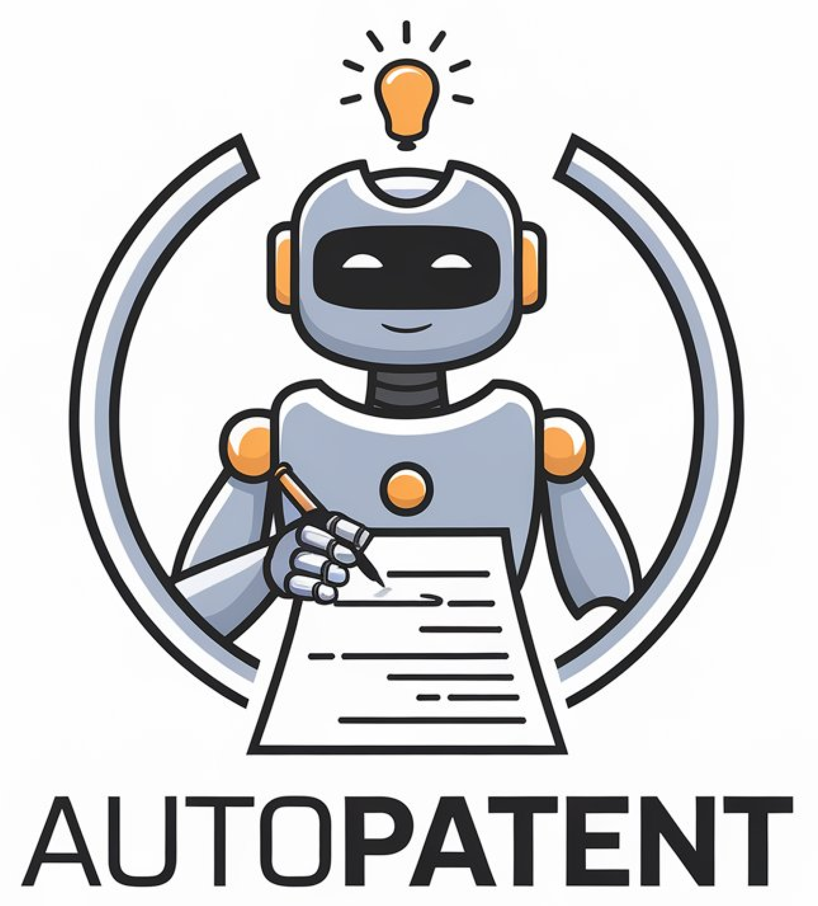

<h3 align="center"></h3>
<h3 align="center"><strong>AutoPatent</strong>: A Multi-Agent Framework for Automatic Patent Generation</h3>

  <p align="center">
    <a href="https://QiYao-Wang.github.io/">Qiyao Wang</a><sup>1,2*</sup>,
    <a href="https://nishiwen1214.github.io/">Shiwen Ni</a><sup>1*</sup>,
    <a>Huaren Liu</a><sup>2</sup>,
    <a>Shule Lu</a><sup>2</sup>,
    <a>Guhong Chen</a><sup>1,3</sup>,
    <br>
    <a>Xi Feng</a><sup>1</sup>,
    <a>Chi Wei</a><sup>1</sup>,
    <a>Qiang Qu</a><sup>1</sup>,
    <a>Hamid Alinejad-Rokny</a><sup>5</sup>,
    <a>Yuan Lin</a><sup>2†</sup>,
    <a>Min Yang</a><sup>1,4†</sup>
    <br>
    *Equal Contribution, † Corresponding Authors.
    <br>
    <sup>1</sup>Shenzhen Key Laboratory for High Performance Data Mining, Shenzhen Institute of Advanced Technology, Chinese Academy of Sciences
    <br>
    <sup>2</sup>Dalian University of Technology
    <br>
    <sup>3</sup>Southern University of Scienceand Technology
    <br>
    <sup>4</sup>Shenzhen University of Advanced Technology
    <br>
    <sup>5</sup>The University of New South Wales
</p>

<div align="center">
 <a href=''></a> &nbsp;&nbsp;&nbsp;&nbsp;&nbsp;
<!-- <a href='https://arxiv.org/abs/[]'></a> &nbsp;&nbsp;&nbsp;&nbsp;&nbsp; -->
 <a href='https://QiYao-Wang.github.io/AutoPatent/'></a> &nbsp;&nbsp;&nbsp;&nbsp;&nbsp;
 <a href=''></a> &nbsp;&nbsp;&nbsp;&nbsp;&nbsp;
 <a href=''></a> &nbsp;&nbsp;&nbsp;&nbsp;&nbsp;
 <br>
 <br>
</div>

## 📢 News

- [2024-08-30] Research Beginning.
- [2024-12-13] We have submitted our paper to arXiv, and it will be publicly available soon.
- [2024-12-13] We have released the initial version of AutoPatent on GitHub. The complete code and data will be made publicly available following the paper’s acceptance.

## Table of Contents

- [Overview](#-overview)
- [Quick Start](#-overview)
- [Experiment Detail](#experiment-detail)
  - [Metric](#metric)
    - [Objective Metric](#objective-metric)
    - [Human Evaluation](#human-evaluation)
  - [Compared Method](#compared-method)
    - [Zero-Shot Prompting](#zero-shot-prompting)
    - [Supervised Fine-Tuning](#supervised-fine-tuning)
  - [Results](#results)
    - [Objective Metric Results](#objective-metric-results)
    - [Human Evaluation Results](#human-evaluation-results)
- [Demo](#demo)
- [Citation](#citation)
- [Contact](#contact)

## 📖 Overview

We introduce a novel and practical task known as **Draft2Patent**, along with its corresponding **D2P benchmark**, which challenges LLMs to generate full-length patents averaging 17K tokens based on initial drafts. Patents present a significant challenge to LLMs due to their specialized nature, standardized terminology, and extensive length. 

We propose a multi-agent framework called **AutoPatent** which leverages the LLM-based planner agent, writer agents, and examiner agent with PGTree and RRAG to generate to craft lengthy, intricate, and high-quality complete patent documents. 


## 🧐 Quick Start

We will make the data and code available upon the paper's acceptance.

## Experiment Detail

### Metric
#### Objective Metric
We use the n-gram-based metric, BLEU, the F1 scores of ROUGE-1, ROUGE-2, and ROUGE-L as the objective metrics. 

We propose a new metric, termed IRR (Inverse Repetition Rate), to measure the degree of sentence repetition within the patent $\mathcal{P}=\\{s_i|1\le i\le n\\}$, which consists of $n$ sentences. 

The IRR is defined as:

$$
IRR (\mathcal{P}, t) = \frac{C_n^2}{\sum_{i=1}^{n-1} \sum_{j=i+1}^{n} f(s_i, s_j) + \varepsilon}
$$

Where the time complexity of the IRR metric is $O(n^2)$, $\varepsilon$ is a small value added for smoothing to prevent division by zero, and $t$ is threshold for determining whether two sentences, $s_i$ and $s_j$, are considered repetitions based on their Jaccard similarity $J$, calculated after removing stop words.

The function $f(s_i, s_j)$ is defined as:

$$
f(s_i, s_j) =
	\begin{cases}
	1, & \text{if } J(s_i, s_j) \geq t, \\
	0, & \text{if } J(s_i, s_j) < t.
	\end{cases}
$$

#### Human Evaluation
We invite three experts who are **familiar with the patent law** and **patent drafting** to evaluate the quality of generated patent using a single-bind review. 

### Compared Method
#### Zero-Shot Prompting
The prompt is provided in Appendix C.1 of the paper.

**Models:**
- Commercial Model
  - GPT-4o
  - GPT-4o-mini
- Open source model
  - LLAMA3.1 (8B and 70B)
  - Qwen2.5 (7B, 14B, 32B and 72B)
  - Mistral-7B
 
#### Supervised Fine-Tuning
We utilize 1,500 draft-patent pairs from D2P’s training set to perform fully supervised fine-tuning on LLAMA3.1-8B, Qwen2.5-7B, and Mistral-7B models (each with fewer than 14 billion parameters).

The fine-tuning process leverages [LLaMA-Factory](https://github.com/hiyouga/LLaMA-Factory) as the tool for efficiently fine-tuning models.

### Results
#### Objective Metric Results


#### Human Evaluation Results


## Demo
We have released the first demo video of AutoPatent on our [website](https://qiyao-wang.github.io/Autopatent).


A publicly accessible and customizable demo will be available upon the paper's acceptance.

## Citation

If you find this repository helpful, please consider citing the following paper:

```bib
coming soon...
```

## Contact
<!-- email -->

If you have any questions, feel free to contact us at `wangqiyao@mail.dlut.edu.cn` or `sw.ni@siat.ac.cn`.

